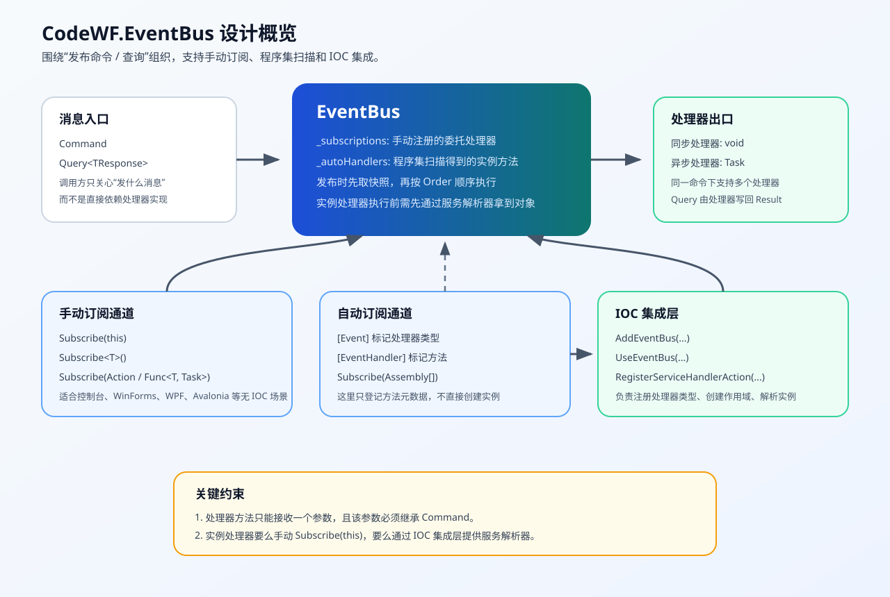

# CodeWF.EventBus 设计文档

## 文档目的

这份文档面向两个场景：

1. 以后重新回到仓库时，能快速理解 `CodeWF.EventBus` 的工程结构和设计思路。
2. 需要继续扩展事件总线能力时，能先知道当前实现的边界和关键约束。

## 架构图



## 工程结构

当前仓库主要分为 4 类项目：

### 1. 核心库

- `src/CodeWF.EventBus`

职责：

- 定义 `Command`、`Query<TResponse>`、`EventAttribute`、`EventHandlerAttribute`
- 提供 `IEventBus` 抽象和 `EventBus` 默认实现
- 维护手动订阅列表和程序集扫描得到的实例处理器列表

### 2. IOC 集成库

- `src/CodeWF.AspNetCore.EventBus`
- `src/CodeWF.IOC.EventBus`
- `src/CodeWF.DryIoc.EventBus`

职责：

- 扫描标记了 `[Event]` 的处理器类型
- 注册到各自的 IOC 容器
- 在启动阶段把服务解析回调交给 `EventBus`

### 3. 示例与共享模型

- `src/WebAPIDemo`
- `src/CodeWF.EventBus.ConsoleAOT`
- `src/CodeWF.EventBus.AvaAOT`
- `src/WindowsFormsApp1_4_8`
- `src/CommandAndQueryModel`

职责：

- 演示无 IOC 和有 IOC 两种使用方式
- 展示命令、查询、处理器和宿主程序的关系

### 4. 测试项目

- `src/CodeWF.EventBus.Tests`

职责：

- 验证手动订阅、扫描指定类型注册处理器、重复订阅去重、自动发现实例处理器缺少解析器时的行为等

## 核心概念

### 1. Command

`Command` 是所有消息的基类，表示“要广播给处理器的消息”。

它有两种典型用途：

- 普通命令：只负责通知，不要求返回值
- 查询命令：通过 `Query<TResponse>` 继承体系返回结果

### 2. Query<TResponse>

`Query<TResponse>` 继承自 `Command`，但多了一个 `Result` 属性。

设计上它仍然走同一条发布链路，只是处理器会在执行完之后，把结果写回 `Result`：

```csharp
public sealed class ProductQuery : Query<ProductItemDto?>
{
    public Guid ProductId { get; set; }
    public override ProductItemDto? Result { get; set; }
}
```

这样做的好处是：

- 发布命令和发布查询的入口统一
- 查询调用方不需要直接依赖具体服务实现

## 处理器模型

当前事件总线支持三种注册方式。

处理方法声明支持：

- `public`
- `private`
- `static`

但不同注册方式扫描到的方法范围不同，下面分开说明。

### 1. 直接注册委托

示例：

```csharp
eventBus.Subscribe<PingCommand>(command => Console.WriteLine(command.Message));
```

适合：

- 轻量脚本式用法
- 控制台或 Demo 场景

### 2. 注册类型处理器

示例：

```csharp
eventBus.Subscribe<StaticHandler>();
```

内部会扫描这个类型里的 `public/private static` 方法，找到带 `[EventHandler]` 的方法后注册进去。

适合：

- 无需依赖实例状态的处理器
- 无 IOC 场景下又希望把逻辑集中到单独类型里的情况

### 3. 注册实例处理器

示例：

```csharp
eventBus.Subscribe(this);
```

内部会扫描当前对象实例上的 `public/private instance` 方法，找到带 `[EventHandler]` 的方法并创建委托。

适合：

- ViewModel、Form、Service 等具备实例状态的对象
- 无 IOC 场景下的手动订阅

## EventBus 内部设计

`EventBus` 当前把订阅信息拆成两类：

### 1. `_subscriptions`

类型：

```csharp
ConcurrentDictionary<Type, List<SubscriptionEntry>>
```

含义：

- Key：命令类型
- Value：这个命令对应的“已经可直接调用的委托列表”

来源：

- `Subscribe(this)`
- `Subscribe<T>()`
- `Subscribe(Action<TCommand>)`
- `Subscribe(Func<TCommand, Task>)`

这类订阅在发布时最直接，因为已经拿到了委托，可以直接 `DynamicInvoke`。

### 2. `_autoHandlers`

类型：

```csharp
ConcurrentDictionary<Type, List<DiscoveredHandlerMethod>>
```

含义：

- Key：命令类型
- Value：这个命令对应的“实例方法元数据列表”

来源：

- `Subscribe(Assembly[])`

这类订阅只登记“哪个类型、哪个方法可以处理命令”，并不立即创建对象实例。

真正发布时，`EventBus` 会借助 `RegisterServiceHandlerAction(...)` 提供的服务解析回调，先拿到实例对象，再把方法绑定成委托执行。

## 为什么要有服务解析回调

这是当前设计里最关键的桥接点。

主库 `CodeWF.EventBus` 的目标是保持轻量，不直接依赖：

- `Microsoft.Extensions.DependencyInjection`
- `DryIoc`
- Prism
- 其他 IOC 框架

所以主库只知道两件事：

1. 某个命令有哪些实例方法可以处理。
2. 真正执行时，需要有一个“按类型拿对象”的能力。

这个能力就是 `RegisterServiceHandlerAction(Action<Type, Action<object>>)`。

不同集成库负责把各自 IOC 容器的解析逻辑包装成统一回调：

- `CodeWF.AspNetCore.EventBus` 使用 `CreateScope()` + `GetRequiredService(type)`
- `CodeWF.DryIoc.EventBus` 使用 `OpenScope()` + `Resolve(type)`
- `CodeWF.IOC.EventBus` 直接接受用户传入的 `Func<Type, object>`

这样主库不用关心 IOC 细节，IOC 集成层也不用复制发布逻辑。

## 发布链路

以 `PublishAsync(command)` 为例，整体流程如下：

### 第一步：参数校验

- `command` 不能为空

### 第二步：执行手动注册的处理器

- 根据 `command.GetType()` 从 `_subscriptions` 找到对应列表
- 取一个按 `Order` 排序后的快照
- 顺序执行每个委托
- 如果返回 `Task`，就等待完成

### 第三步：执行自动发现的实例处理器

- 根据 `command.GetType()` 从 `_autoHandlers` 找到对应方法列表
- 如果列表非空，则必须已经注册服务解析回调
- 逐个解析实例、创建委托、执行方法

### 第四步：查询回写

如果消息本身是 `Query<TResponse>`，处理器会把结果写回 `Result`，随后：

- `Query(...)` 返回 `query.Result`
- `QueryAsync(...)` 返回 `query.Result`

## 当前并发与一致性策略

事件总线内部虽然使用了 `ConcurrentDictionary`，但值类型仍是 `List<T>`，所以当前实现又额外引入了两个锁对象：

- `_subscriptionsSync`
- `_autoHandlersSync`

这样做的原因是：

- 订阅 / 取消订阅 会修改 `List<T>`
- 发布时如果直接枚举原列表，容易与修改冲突

当前策略是：

1. 修改列表时加锁
2. 发布前先生成快照数组
3. 对快照排序后再执行

这样能保证：

- 发布期间不会因为集合被修改而抛枚举异常
- 订阅和取消订阅的并发行为更稳定

## 去重策略

当前实现会自动避免重复注册同一个处理器。

### 手动订阅去重

比较条件：

- 目标对象引用相同
- 方法签名相同

这样可以避免：

- 重复调用 `Subscribe(this)`
- 重复注册同一个扫描命中的委托

### 自动扫描去重

比较条件：

- 处理器类型相同
- 方法签名相同

这样可以避免：

- `UseEventBus()` 被重复调用后，同一实例处理器重复登记

## 方法约束

被 `[EventHandler]` 标记的方法必须满足这些约束：

1. 参数只能有一个
2. 参数类型必须继承 `Command`
3. 返回值必须是 `void` 或 `Task`

如果不满足，扫描阶段会直接忽略，不参与订阅。

## Order 的作用

`EventHandlerAttribute.Order` 用于控制同一命令下多个处理器的执行顺序。

约定：

- 值越小越先执行
- 默认值是 `0`

这在下面这些场景比较有用：

- 先校验，再执行业务
- 先写库，再发通知
- 先落审计日志，再触发后续副作用

## 典型宿主使用方式

### 无 IOC 容器

典型宿主：

- WinForms
- WPF
- Avalonia
- Console

建议做法：

- 扫描指定类型注册的处理器用 `Subscribe<T>()`
- 实例处理器用 `Subscribe(this)`
- 对生命周期明确的对象，在销毁时调用 `Unsubscribe(this)`

### 有 IOC 容器

典型宿主：

- ASP.NET Core
- Prism + DryIoc
- 自定义 IOC 容器项目

建议做法：

1. 启动时先注册 EventBus
2. 扫描 `[Event]` 处理器类型并注册到容器
3. 在应用完成构建后执行 `UseEventBus()`

## 为什么库里同时保留 Default 和 IEventBus

这是为了兼顾两类项目：

### 1. 快速上手型项目

直接使用：

```csharp
EventBus.Default.Publish(...)
```

优点：

- 简单
- 不依赖 IOC

### 2. 工程化项目

通过依赖注入使用：

```csharp
public MyService(IEventBus eventBus)
{
    _eventBus = eventBus;
}
```

优点：

- 更便于测试
- 更符合现代应用架构
- 生命周期更可控

## 目前需要记住的几个边界

### 1. 自动发现实例处理器必须配合服务解析器

也就是说，单独调用：

```csharp
eventBus.Subscribe(new[] { someAssembly });
```

还不够。

如果之后发布到了实例处理器对应的命令，但没有先调用 `RegisterServiceHandlerAction(...)`，就会抛出清晰异常。

### 2. Query 是否允许空结果，由查询类型自己决定

例如：

```csharp
public sealed class ProductQuery : Query<ProductItemDto?>
{
    public override ProductItemDto? Result { get; set; }
}
```

如果你希望“查不到也是合法结果”，就把结果类型声明成可空。

### 3. 手动订阅的实例对象需要自己管理生命周期

`Subscribe(this)` 很方便，但如果对象已经不用了又没取消订阅，就可能在后续仍然收到消息。

## 建议的阅读顺序

如果以后再回来看代码，建议按这个顺序读：

1. `src/CodeWF.EventBus/Command.cs`
2. `src/CodeWF.EventBus/Query.cs`
3. `src/CodeWF.EventBus/IEventBus.cs`
4. `src/CodeWF.EventBus/EventBus.cs`
5. `src/CodeWF.EventBus/EventBus.Subscribe.cs`
6. `src/CodeWF.EventBus/EventBus.Publish.cs`
7. `src/CodeWF.EventBus/EventBus.Unsubscribe.cs`
8. `src/CodeWF.EventBus/EventBusExtensions.cs`
9. `src/CodeWF.AspNetCore.EventBus/EventBusExtensions.cs`
10. `src/CodeWF.IOC.EventBus/EventBusExtensions.cs`
11. `src/CodeWF.DryIoc.EventBus/EventBusExtensions.cs`
12. `src/CodeWF.EventBus.Tests/`

## 后续可继续演进的方向

如果未来继续扩展，这几个方向最值得考虑：

### 1. 替换 DynamicInvoke

当前实现为了兼容不同签名的处理器，使用了 `DynamicInvoke`，优点是简单，缺点是：

- 反射开销更高
- 运行时错误更晚暴露

后续可以考虑缓存强类型调用委托。

### 2. 显式支持取消自动发现的实例处理器

当前 `Subscribe(Assembly[])` 主要用于启动期注册，通常只做一次。
如果未来有“模块动态装卸载”的需求，可以考虑补充自动处理器的取消登记机制。

### 3. 增加诊断能力

例如：

- 当前有哪些命令被订阅
- 每个命令有几个处理器
- 发布链路日志与耗时统计

这些能力对排查大型项目中的事件链非常有帮助。
